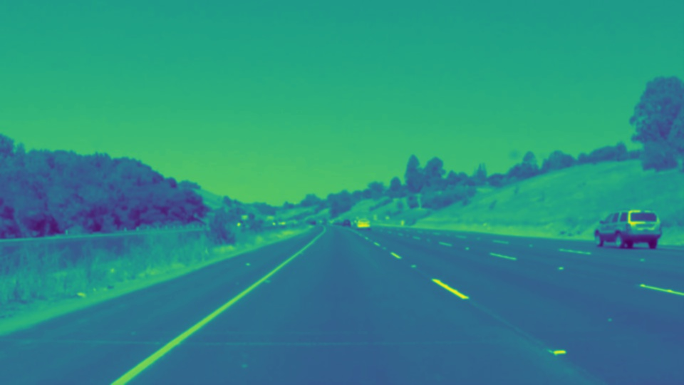
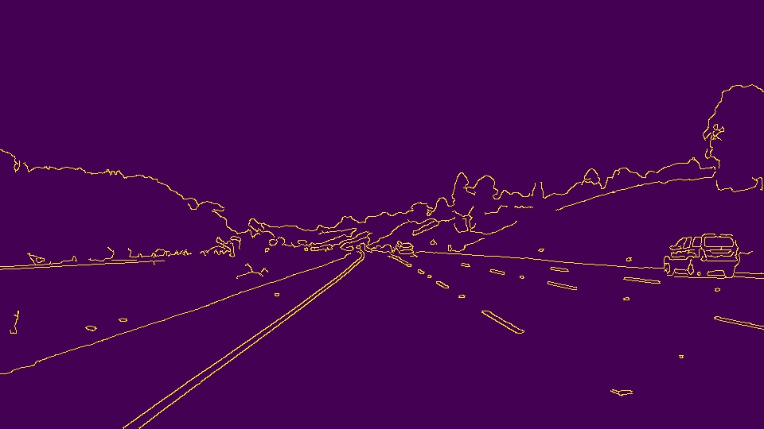
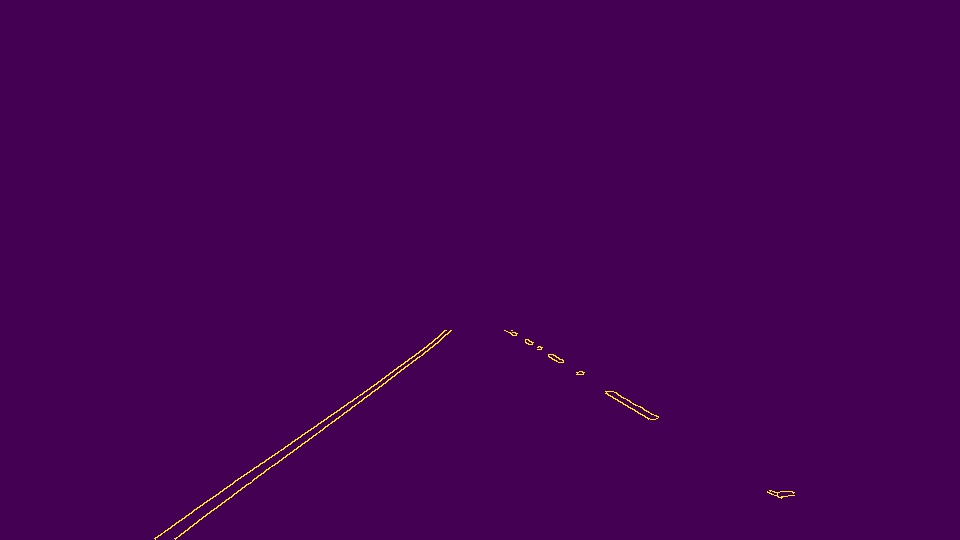
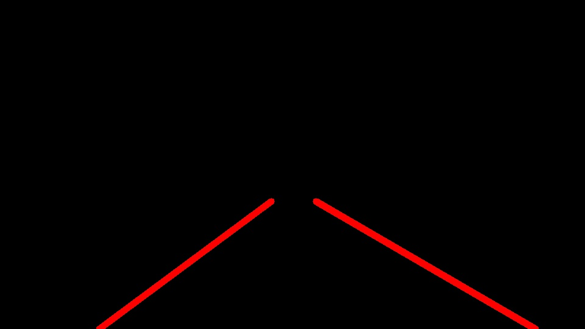
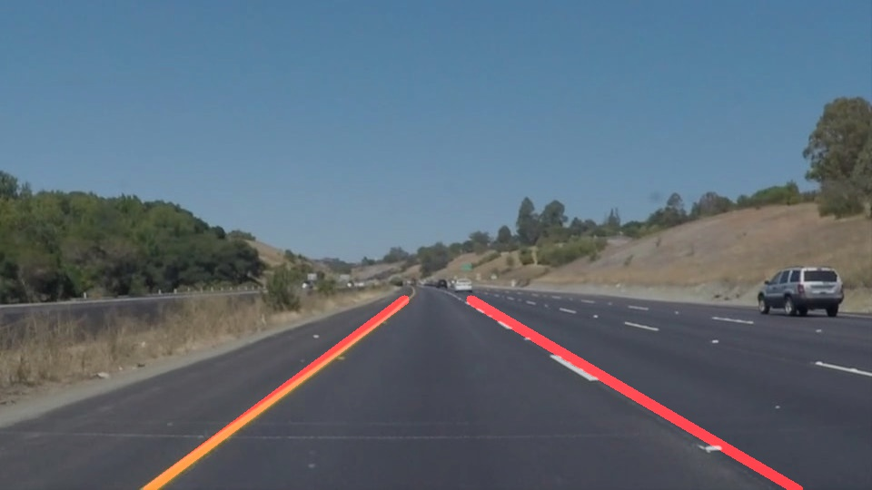

# **Finding Lane Lines on the Road**
[](http://www.udacity.com/drive)


Overview
---

When we drive, we use our eyes to decide where to go. The lines on the road that show us where the lanes are act as our constant reference for where to steer the vehicle. Naturally, one of the first things we would like to do in developing a self-driving car is to automatically detect lane lines using an algorithm.

The goals / steps of this project are the following:
* Make a pipeline that finds lane lines on the road
* Reflect on your work in a written report

[//]: # (Image References)

 


---

### Reflection

### 1. Pipeline description

My pipeline consist of 7 steps:

1. Grayscale:
```python
    image = grayscale(image)
```


2. Gaussian smoothing:
```python
    image = gaussian_blur(image, kernel_size)
```


3. Canny:
```python
    image = canny(image,low_threshold, high_threshold)
```


4. Region of Interest:
```python
    image = region_of_interest(image, vertices)
```


5. Hough transform to detect line segments:
```python
    lines = hough_lines(image, rho, theta, threshold, min_line_len, max_line_gap)
```
6. Get image with lines:
```python
    image = draw_lines(line_img, lines, period=30)
```
Here after performing Hough transform we get set of lines which are separated by slop to left and right subsets. Then moving average is used to 
filter segment's params (slop and intercept) of left and right lines. 
Then avarage segment's params are used to extrapolate lines.

```python
def draw_lines(img, lines, period, treshold=0.5, color=[255, 0, 0], thickness=10):
    """
    This function draws `lines` with `color` and `thickness`.
    Lines are drawn on the image inplace (mutates the image).
    If you want to make the lines semi-transparent, think about combining
    this function with the weighted_img() function below
    """
    global L_lines, R_lines
    
    #init global with empty array
    if L_lines == None:
        L_lines = np.empty([0, 2], dtype=float)
    if R_lines == None:
        R_lines = np.empty([0, 2], dtype=float)
    
    #itarate over found lines from Hough algorithm
    for line in lines:
        for x1,y1,x2,y2 in line:
                if x1 == x2:
                    continue
                slop = (y2-y1)/(x2-x1)       #get slop 
                intercept = y1 - slop * x1   #get intercept
                if slop > treshold:          #if slop > treshold so line is part of right lane line
                    if len(R_lines) >= period:
                        #collect right line params to calculate moving average with defined period 
                        R_lines = np.delete(R_lines, 0, axis=0)                  #delete most old right line params
                        R_lines = np.append(R_lines, [[slop,intercept]], axis=0) #add newest right line params
                    else:
                        #fill array with right line params until average window is filled
                        R_lines = np.append(R_lines, [[slop,intercept]], axis=0) 
                elif slop < -(treshold):     #if slop < -(treshold) so line is part of left lane line
                    if len(L_lines) >= period:
                        #collect left line params to calculate moving average with defined period 
                        L_lines = np.delete(L_lines, 0, axis=0)                  #delete most old left line params
                        L_lines = np.append(L_lines, [[slop,intercept]], axis=0) #add newest left line params
                    else:
                        #fill array with left line params until average window is filled
                        L_lines = np.append(L_lines, [[slop,intercept]], axis=0)
    
    yb = img.shape[0]                        #define bottom Y
    yt = 330                                 #define top Y
    
    if len(R_lines) >= period:               #draw line only if average window is filled
        s,i = np.mean(R_lines, axis=0)       #calculate avarage value for every right line params
        Rxb = int(get_x(float(yb), s, i))    #get bottom right X
        Rxt = int(get_x(float(yt), s, i))    #get top right X

        plt.plot([Rxb, yb], [Rxt, yt], 'r-', label="R")       #add right line to plot (for debug)
        cv2.line(img, (Rxb, yb), (Rxt, yt), color, thickness) #add right line to img
    
    if len(L_lines) >= period:               #draw line only if average window is filled
        s,i = np.mean(L_lines, axis=0)       #calculate avarage value for every left line params
        Lxb = int(get_x(float(yb), s, i))    #get bottom left X
        Lxt = int(get_x(float(yt), s, i))    #get top left X

        plt.plot([Lxb, yb], [Lxt, yt], 'b-', label="L")       #add left line to plot (for debug)
        cv2.line(img, (Lxb, yb), (Lxt, yt), color, thickness) #add left line to img
    
    return img
```


7. Draw the lines on the origin image
```python
    image = weighted_img(image, image_orig)
```



## Whole pipeline:
```python
    image_orig = image

    #1. Grayscale the image
    image = grayscale(image)

    #2. Apply Gaussian smoothing
    image = gaussian_blur(image, kernel_size)

    #3. Apply Canny
    image = canny(image,low_threshold, high_threshold)

    #3. This time we are defining a four sided polygon to mask and apply
    vertices = np.array([corners(image)], dtype=np.int32)
    image = region_of_interest(image, vertices)

    #5. Run Hough on edge detected image
    lines = hough_lines(image, rho, theta, threshold, min_line_len, max_line_gap)
    
    #6. Get image with lines
    line_img = np.zeros((image_orig.shape[0], image_orig.shape[1], 3), dtype=np.uint8)
    image = draw_lines(line_img, lines, period=30)

    #7. Draw the lines on the origin image
    image = weighted_img(image, image_orig)
```

### 2. Identify potential shortcomings with your current pipeline

1. The code is only detects the straight lane lines
2. If some phantom line segmants will appear in region of interest it will corrupt detection, like in challenge.mp4


### 3. Suggest possible improvements to your pipeline

1. Try to use Savitzky-Golay filtering method
2. Use non-linear extrapolation
